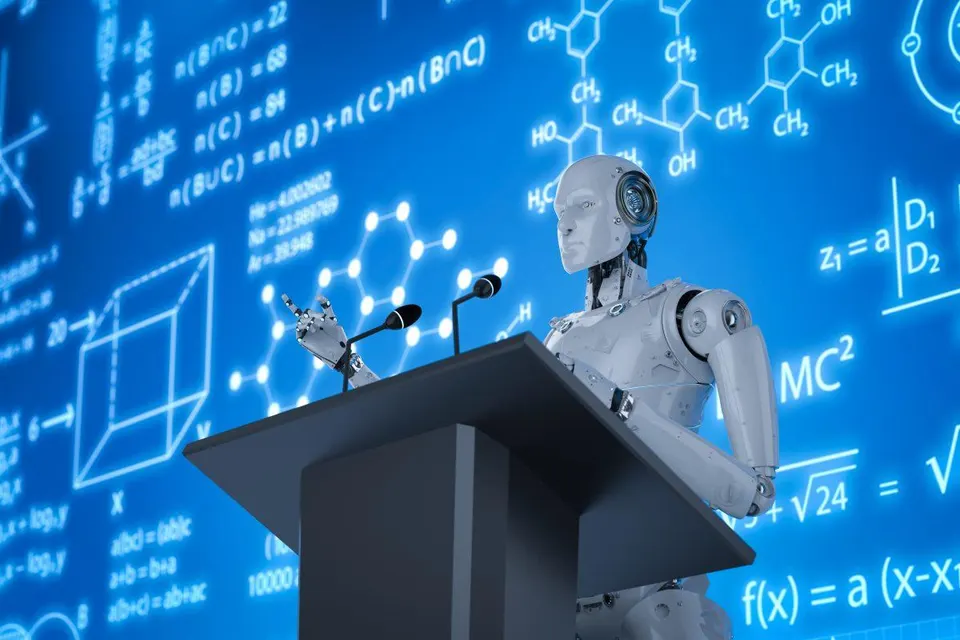
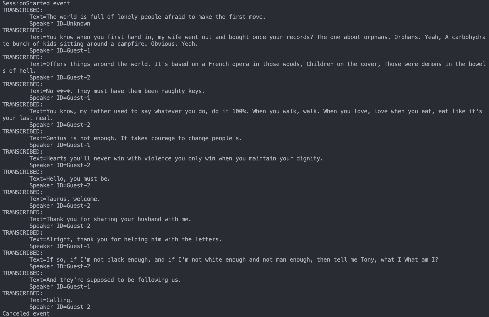

# Learning User Skills During a Collaborative Task

*This is a repository for UROP summer 2023, supervised by Dr. Nicole Salomons*

<em>Image generated by  Adobe Stock</em>

## Introduction   
Robot tutoring for multiple people is an emerging educational approach that leverages the capabilities of advanced robotic systems to enhance the learning experience of groups of individuals simultaneously. Within this project, we focused on the task of building circuits, which can be complex and challenging, especially for beginners. Traditional classroom settings often face challenges in providing personalized attention to each student, which can limit the effectiveness of teaching and hinder student engagement.

Robot tutoring in circuit building addresses these challenges by introducing specialized robot capable of guiding and assisting multiple learners. The robot is equipped with sensors, manipulators, and instructional algorithms that aim to interact with students, offering step-by-step guidance, real-time feedback, and troubleshooting assistance during the circuit-building process. Moreover, they will feature skill-estimation algorithm, capable of gauging students' proficiency levels, thereby facilitating the delivery of personalized assistance.

## Circuit Model

https://github.com/Julie3399/UROP2023/assets/85987946/37b853e2-d17a-4372-9da0-ee934f404ef5

The video sequence showcases different stages of the process, ordered from top to bottom and right to left: "Raw Input Video," "Video with Hand Detection," "YOLO Object Detection on Video," "Board Model," and "Output from the Verification Process."

This empowers the robot with the ability to track piece additions, identify their types, determine the contributor, and recognize skills acquired or yet to be acquired. It's important to note that the task's completion status is represented by the observation vector in the bottom-right video. Within this vector, 0 signifies an absence of the required skill, 1 indicates successful skill acquisition, and 2 represents the non-existence of the skill in task.

## User Model

We have developed two models using MediaPipe (Website where more information can be found: https://developers.google.com/mediapipe/solutions/vision/hand_landmarker):

### Hand Detection Model:
- This model is designed to recognize whose hand it is by analyzing the direction of the fingers.
- Its remarkable stability extends to scenarios involving shifts in hand position and instances of partial overlap.
- In Demo Video 1, we demonstrate its adeptness at distinguishing changes in both hand position and finger orientation. Meanwhile, in Demo Video 2, we shows its ability to deal with situation with overlapping hands.

https://github.com/Julie3399/UROP2023/assets/85987946/5f9f8a01-020c-4af7-aaad-a6fb2ebd7a5f

https://github.com/Julie3399/UROP2023/assets/85987946/e6c8381b-e34e-4729-8b02-ebd173a0b33d

## Holistic Model:
- Our Holistic Model is built to provide a comprehensive understanding of human subjects. While there are opportunities for performance enhancement (stability in multiple person detection awaiting for improvement), the model's potential is substantial. 
- It possesses the capacity to comprehend intricate details like facial expressions and body language, crucial factors in assessing emotions and confidence levels. This enhances our ability to more accurately estimate skill levels of the users.

https://github.com/Julie3399/UROP2023/assets/85987946/77953812-3f81-488b-8494-8d8bc74c6786

## Speaker Model:
- Our speaker model uses Azure services from Microsoft which combines diarization with speech to text functionality to provide transcription outputs that contain a speaker entry for each transcribed speech.
- The transcription output is tagged as GUEST1, GUEST2, GUEST3, etc. based on the number of speakers in the audio conversation.
- We mainly used ConversationTranscriber API from Microsoft.
- The output of this model is of the following while two people reading the dialogue from the movie Green Book: 

<em>Output of the Speaker Model</em>

